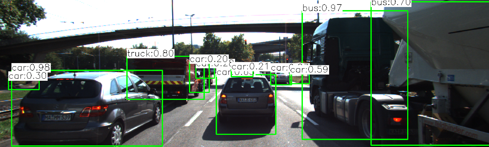
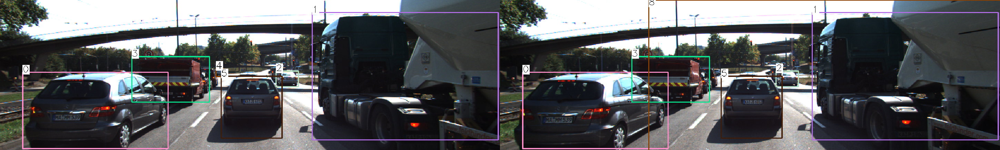
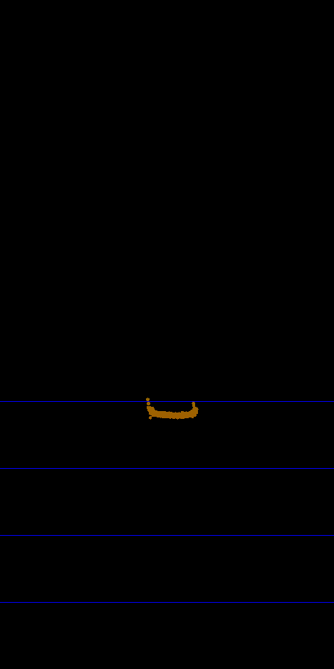
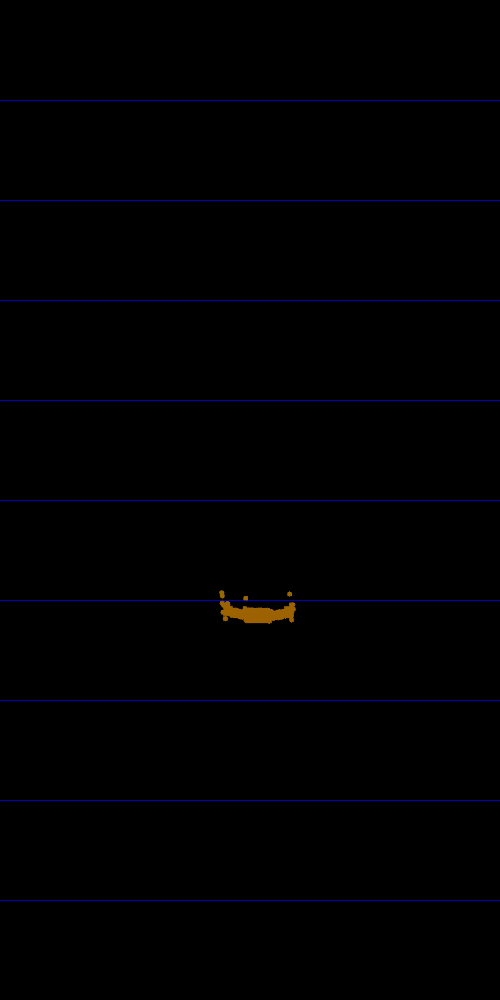
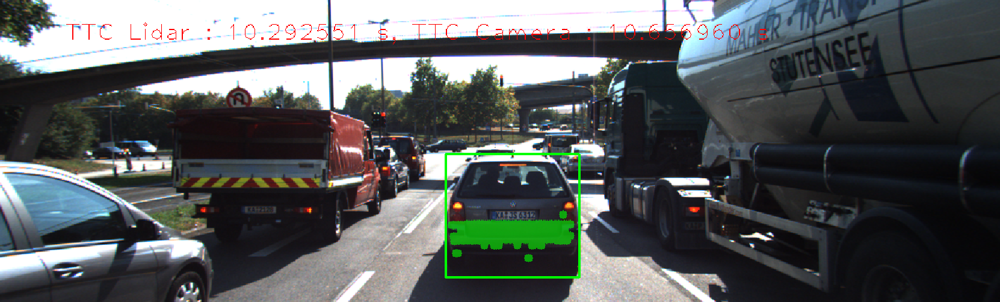
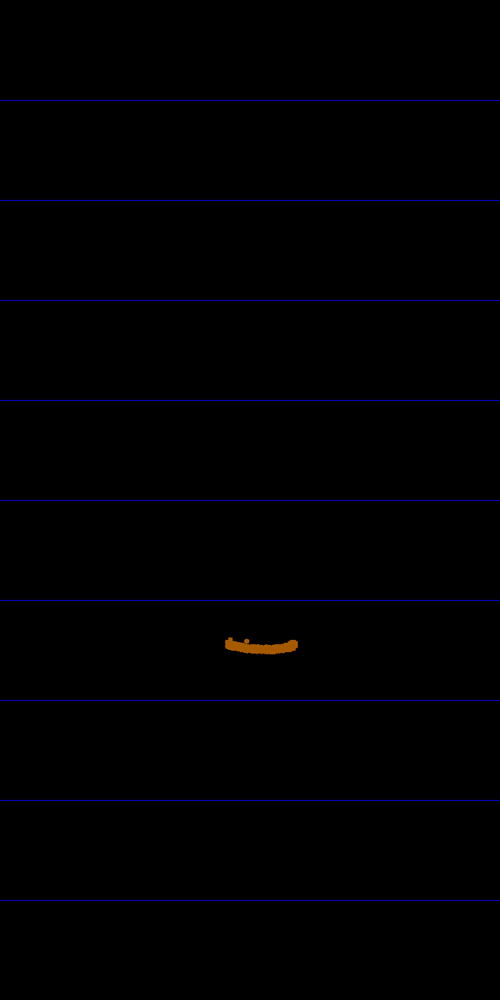
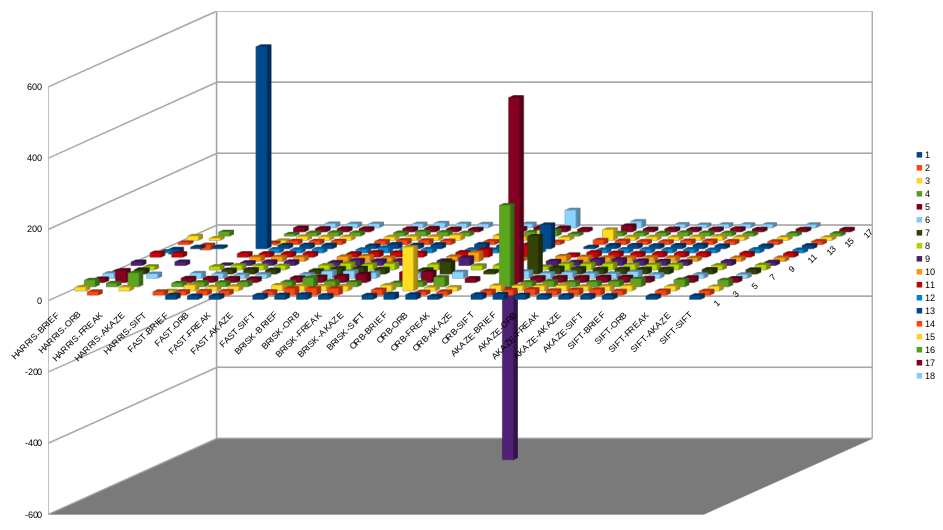

Track an Object in 3D Space
============================
## Final Report
Following is a final report write up for the Udacity Sensor Fusion Nanodegree section related to tracking an object in 3D using lidar and camera sensors to determine a time to collision for a vehicle that is in the same ego lane.


## Match 3D Objects

The method `matchBoundingBoxes` was implemented in `camFusion_Student.cpp`. It takes as input both the current and previous data frames (which are already populated with YOLO detected bounding boxes for each frame) and a corresponding set of Key Point descriptor matches between the current and previous images contained in the data frame. The output is an updated `bbBestMatches` variable containing a unique set of previous bounding boxes matched to current bounding boxes. The bounding boxes are represented by a unique integer `boxId`.



The algorithm first iterates through the matches, extracting the keypoints referenced. 

It then for each of the sets of bounding boxes determines if the keypoint is enclosed by it and records a unique set of box id matches along with updating a count (for the bounding box).

A counter is updated in `boundingBoxesMatches` for each box id (previous, current) pair match found. The counter determines, which pair has the most occurences of a match. As well it stores a complete set of box ids found for both current and previous.
```
prev boxId (KeyPoint size)s: 0 (516) 1 (454) 2 (57) 3 (339) 4 (8) 5 (209)
curr boxId (KeyPoint size)s: 0 (560) 1 (390) 2 (46) 3 (312) 4 (170) 5 (203) 6 (29) 7 (27) 8 (42) 9 (35) 10 (110)
bounding box max keypoints {prev,curr} (n_keypoints): {0,0}(515) {0,1}(1) {0,3}(117) {0,7}(10) {1,1}(369) {1,3}(1) {1,4}(169) {1,6}(4) {2,2}(45) {2,5}(14) {2,6}(4) {3,0}(128) {3,3}(309) {3,8}(21) {3,10}(88) {4,8}(4) {5,2}(13) {5,5}(200) {5,9}(6)
prevBoxIdSet: 0 1 2 3 4 5
currBoxIdSet: 0 1 2 3 4 5 6 7 8 9 10

```

To make sure that bounding box matches happen from candidates with the highest number of occurrences, a set of descending match counts is created.
```
prevBoxIdKeyPointCountDescending boxId (matches): 0 (516) 1 (454) 3 (339) 5 (209) 2 (57) 4 (8)
```

The `bbBestMatches` is updated with a previous and current box id pair, where the corresponding current box id, is a match with the same classification and the highest match count from the `boundingBoxesMatches` created earlier. A current box id can only be used once and the intiial set is populated from that determined in `currBoxIdSet`.

```
matching prevBoxId: 0 {0,0}(515)<- {0,1}(1)? {0,3}(117)? {0,7}(10) currBoxIdBest: 0 matches (shared, prev, curr): (515, 516, 560)
matching prevBoxId: 1 {1,1}(369)<- {1,3}(1)? {1,4}(169) {1,6}(4)? currBoxIdBest: 1 matches (shared, prev, curr): (369, 454, 390)
matching prevBoxId: 3 {3,0}(128)? {3,3}(309)<- {3,8}(21)? {3,10}(88)? currBoxIdBest: 3 matches (shared, prev, curr): (309, 339, 312)
matching prevBoxId: 5 {5,2}(13)<- {5,5}(200)<- {5,9}(6) currBoxIdBest: 5 matches (shared, prev, curr): (200, 209, 203)
matching prevBoxId: 2 {2,2}(45)<- {2,5}(14)x {2,6}(4) currBoxIdBest: 2 matches (shared, prev, curr): (45, 57, 46)
matching prevBoxId: 4 {4,8}(4)<- currBoxIdBest: 8 matches (shared, prev, curr): (4, 8, 42)
```
note: `<-` shows the highest pair found as it loops through, `?` box classification different, `x` current box id already allocated. 

The result of this is `bbBestMatches` updated with a previous box id, current box id pair as follows. The graphic also shows the colour coded matches with the box ids.
```
bbBestMatches {prev,curr}: {0,0} {1,1} {2,2} {3,3} {4,8} {5,5}
```



note: the box colours are unique for each bounding box match (so the left with the previous image should match to the current image on the right)

## Compute Lidar-based TTC

The method `computeTTCLidar` was implemented in `camFusion_Student.cpp`. It takes as input the previous and current lidar points with a frame rate (in Hz) to return a Time To Collision value in seconds.

An ego lane width of 4 meters is assumed. Any lidar point not within the ego lane is ignored.

The minimum closest point is found in front of the ego vehicle for previous and current lidar points.

The Time To Collisiion is computed 
```
TTC = minXCurr * dT / (minXPrev - minXCurr);
```
where `dT` is the time between the two measuremetns in second.

The lidar points are prefiltered in the method `filterLidarPointXOutliers` which was implemented in `FinalProject_Camera.cpp`. It calculates the std deviation - sigma and removes points that are 2 times sigma between ego and the vehicle ahead in the ego lane.

```
filter lidarPoints.size(): 307 mean: 7.61796 variance: 0.00481561 sigma: 0.0693946
outlier - d: -0.142964 (7.475,-0.821,-0.9)
```



## Associate Keypoint Correspondences with Bounding Boxes

This method `clusterKptMatchesWithROI` prepares the TTC computation based on camera measurements by associating keypoint correspondces to the bounding boxes which enclose them. Its implemented in `camFusion_Student.cpp`.

Euclidean distance calculation usese the following lambda function
```c++
auto match_distance = [kptsPrev, kptsCurr](const cv::DMatch &dmatch) -> double {
    // extract the keypoint to match on - this is faster then cv::norm
    cv::Point2f prev_pt = kptsPrev[dmatch.queryIdx].pt;
    cv::Point2f curr_pt = kptsCurr[dmatch.trainIdx].pt;

    cv::Point2f diff = prev_pt - curr_pt;
    return cv::sqrt(diff.x*diff.x + diff.y*diff.y);
};
```

`kptrPrev` and `kptsCurr` are supplied to the method as well as a vector of keypoint descriptor matches.

If the current key point contained in the match is enclosed in the passed itbounding box, its added into `bbMatches` and the euclidean distance between  the current and previous key points totaled.

A standard deviation - sigma, is calculated from all the `bbMatches` and outliers determined by the absolute distance being greater than sigma not recorded in `boundingBox.kptMatches`.

```
filter boxID:4 bbMatches.size(): 215 mean: 1.51281 variance: 50.6649 sigma: 7.11793
outlier - d: 102.967
```


## Compute Camera-based TTC


The method `computeTTCCamera` was implemented in `camFusion_Student.cpp`. It takes as input the previous and current keypointss, associated descriptor matches, with a frame rate (in Hz) to return a Time To Collision value in seconds.

Distance ratios are computed between all matched keypoints.

If there are not distance ratios found, NAN (Not a Number) is returned

The following code is used to calculate the Time To Collission and to deal with outliers.

```
std::sort(distRatios.begin(), distRatios.end());
long medIndex = floor(distRatios.size() / 2.0);
double medDistRatio = distRatios.size() % 2 == 0 ? (distRatios[medIndex - 1] + distRatios[medIndex]) / 2.0 : distRatios[medIndex]; // compute median dist. ratio to remove outlier influence

double dT = 1 / frameRate;
TTC = -dT / (1 - medDistRatio);
```

## Performance Evaluation 1
Following are examples of where the TTC estimates from the lidar sensor do not seem plausible with associated observations and discussion.

### TTC liDAR Log
```
TTC: 12.9722 minXCurr: 7.913 minXPrev: 7.974 dT: 0.1
TTC: 12.264 minXCurr: 7.849 minXPrev: 7.913 dT: 0.1
TTC: 13.9161 minXCurr: 7.793 minXPrev: 7.849 dT: 0.1
TTC: 14.8865 minXCurr: 7.741 minXPrev: 7.793 dT: 0.1
TTC: 12.1873 minXCurr: 7.678 minXPrev: 7.741 dT: 0.1
TTC: 7.50199 minXCurr: 7.577 minXPrev: 7.678 dT: 0.1
TTC: 34.3404 minXCurr: 7.555 minXPrev: 7.577 dT: 0.1
TTC: 18.7875 minXCurr: 7.515 minXPrev: 7.555 dT: 0.1
TTC: 15.8894 minXCurr: 7.468 minXPrev: 7.515 dT: 0.1
TTC: 13.7297 minXCurr: 7.414 minXPrev: 7.468 dT: 0.1
TTC: 10.4914 minXCurr: 7.344 minXPrev: 7.414 dT: 0.1
TTC: 10.1 minXCurr: 7.272 minXPrev: 7.344 dT: 0.1
TTC: 9.22307 minXCurr: 7.194 minXPrev: 7.272 dT: 0.1
TTC: 10.9678 minXCurr: 7.129 minXPrev: 7.194 dT: 0.1
TTC: 8.09422 minXCurr: 7.042 minXPrev: 7.129 dT: 0.1
TTC: 8.81392 minXCurr: 6.963 minXPrev: 7.042 dT: 0.1
TTC: 10.2926 minXCurr: 6.896 minXPrev: 6.963 dT: 0.1
TTC: 8.30978 minXCurr: 6.814 minXPrev: 6.896 dT: 0.1
```
### Final Result Examination 1


```
prev filter lidarPoints.size(): 345 mean: 7.72909 variance: 0.00584972 sigma: 0.0764834
curr filter lidarPoints.size(): 315 mean: 7.67321 variance: 0.00524091 sigma: 0.0723942
TTC: 34.3404 minXCurr: 7.555 minXPrev: 7.577 dT: 0.1
```
#### Top View Previous LiDAR data


#### Top View Current LiDAR data


### Observation and reasoning
The gap between the current and previous measurement dropped, possibly indicating a breaking event in the ego vehicle and a break release from the vehicle ahead.  This is supported by the sudden drop to 7.50199 TTC in the preceeding frame, which itself was a drop of ~5 seconds from its precedessor. The sudden drop means that the vehicle in front of the ego vehicle, slowed suddenly. All vehicles displayed have break lights on. Breaking events would alter the pitch of the vehicle and affect the time of flight calculations. When observing the top down views of the lidar data, the shapes appear to be slightly different which would be as a result of hitting the vehicle in different points.


### Final Result Examination 2


```
prev filter lidarPoints.size(): 287 mean: 7.03719 variance: 0.00167172 sigma: 0.0408867
prev filter lidarPoints.size(): 273 mean: 6.97324 variance: 0.00181314 sigma: 0.0425809
TTC: 10.2926 minXCurr: 6.896 minXPrev: 6.963 dT: 0.1
````
#### Top View Previous LiDAR data


#### Top View Current LiDAR data


### Observation and reasoning

Minor noise in the lidar data probably caused by slightly different reflective points, has resulted in a once off increase in TTC. This can be observed by the difference in shape between the current and previous top views of the lidar data. As the vehicles near similar speeds leading to the difference between the two minimums of X coming closer to zero, it will also naturally cause the TTC to increase.

## Performance Evaluation 2

### Time To Collision comparitive results for each detector & descriptor combination

Images number start at 1, as 2 images are required to perform TTC calcs.

If a detector/descripto combination has less than 17 ttc values, then there were occassions where there was too many false positive matches to match bounding boxes.

On the occassion of a nan or a -inf, the TTC calculation could not be calculated.

Based on the follwong data the best detector & descriptor combinations were `FAST-BRIEF`, `FAST-ORB`, `FAST-FREAK`, `FAST-SIFT`,  `BRISK-BRIEF`, `BRISK-ORB`, `BRISK-FREAK`, `BRISK-SIFT`, `AKAZE-ORB`, `AKAZE-FREAK`, `AKAZE-AKAZE`, `AKAZE-SIFT`, `SIFT-BRIEF` and `SIFT-FREAK`.


#### 3D Chart of TTC Camera by detector-descriptor and image no


#### table
det-desc/Image|1|2|3|4|5|6|7|8|9|10|11|12|13|14|15|16|17|18|
---|---:|---:|---:|---:|---:|---:|---:|---:|---:|---:|---:|---:|---:|---:|---:|---:|---:|---:|---:|---:|
HARRIS-BRIEF | nan | nan | 10.9782 | 19.4967 | 11.5723 | 14.2744 | 10.0433 | nan | 11.7414 | nan | 13.4327 | 5.6061 | -14.7808 | 6.71705 | 12.5848 | -inf |
HARRIS-ORB | nan | 10.586 | nan | 10.9782 | 35.3833 | 11.5857 | 13.497 | 10.0433 | nan | nan | 11.7414 | nan | 5.66097 | -14.7808 | 6.6376 | 12.7384 | -inf |
HARRIS-FREAK | nan | nan | 10.9782 | 39.584 | nan | 12.9162 | nan | -inf | 12.245 | nan | nan | -inf | 6.71705 | nan |
HARRIS-AKAZE | - | - | - | - | - | - | - | - | - | - | - | - | - | - | - | - | - | - |
HARRIS-SIFT | nan | 11.0081 | -11.4731 | 10.9782 | 13.3698 | 15.2483 | -inf | 10.0433 | 3.30058 | nan | 11.7414 | nan | 568.322 | 5.6061 | -13.6263 | 6.71705 | 12.7384 | -inf |
FAST-BRIEF | 13.2947 | 11.6079 | 16.8548 | 13.1218 | 13.5942 | 13.5046 | 13.192 | 13.1535 | 10.1573 | 12.8765 | 11.8065 | 11.5078 | 10.8982 | 10.6452 | 11.2648 | 10.3224 | 10.657 | 11.8703 |
FAST-ORB | 11.1736 | 12.2632 | 12.04 | 12.7732 | 13.1975 | 10.9159 | 14.2429 | 12.694 | 12.3713 | 13.426 | 11.8844 | 10.7351 | 11.7063 | 10.6938 | 10.3823 | 11.0187 | 10.5836 | 11.3381 |
FAST-FREAK | 11.8818 | 12.3656 | 13.0529 | 13.4882 | 12.2988 | 11.9523 | 12.7024 | 12.4947 | 12.3431 | 12.7008 | 12.1065 | 12.2033 | 11.612 | 11.1224 | 10.5354 | 10.7863 | 10.2088 | 11.5273 |
FAST-AKAZE | - | - | - | - | - | - | - | - | - | - | - | - | - | - | - | - | - | - |
FAST-SIFT | 13.1432 | 11.2578 | 16.9587 | 14.4249 | 14.7169 | 11.7847 | 11.3522 | 13.2384 | 10.4038 | 14.3446 | 11.7095 | 10.608 | 10.1089 | 10.5264 | 9.76366 | 10.3688 | 10.5823 | 11.1408 |
BRISK-BRIEF | 13.8109 | 19.5623 | 14.4688 | 25.8379 | 17.0557 | 19.9254 | 17.5726 | 18.4531 | 16.7517 | 15.9407 | 14.8279 | 15.6771 | 13.4222 | 12.7265 | 11.2161 | 13.2538 | 11.4147 | 13.6603 |
BRISK-ORB | 14.68 | 20.0407 | 14.0968 | 16.3706 | 19.4029 | 20.629 | 18.0087 | 16.0691 | 15.0829 | 11.4555 | 13.9703 | 13.1293 | 11.5189 | 12.1556 | 11.4651 | 11.8503 | 9.98468 | 11.4493 |
BRISK-FREAK | 12.3483 | 19.5646 | 13.9129 | 13.6652 | 24.3184 | 16.0852 | 15.4463 | 18.0417 | 15.684 | 13.9976 | 13.2506 | 11.7044 | 12.8265 | 11.4007 | 15.1331 | 10.1962 | 9.19943 | 10.6498 |
BRISK-AKAZE | - | - | - | - | - | - | - | - | - | - | - | - | - | - | - | - | - | - |
BRISK-SIFT | 13.1695 | 16.1568 | 16.3625 | 12.0195 | 29.9894 | 13.9525 | 13.3823 | 15.5727 | 15.4538 | 14.2623 | 14.8692 | 10.7423 | 13.6485 | 10.5455 | 13.8918 | 10.9065 | 11.0174 | 11.2224 |
ORB-BRIEF | 16.4544 | -inf | 123.51 | 13.5607 | 30.4194 | -inf | 34.6298 | -inf | 23.2694 | 26.0553 | 22.5603 | 9.84171 | 9.87855 | 8.34236 | 10.4827 | 12.1222 | 13.3681 |
ORB-ORB | 14.596 | 10.1192 | 10.3668 | 27.1889 | -inf | 18.4549 | -inf | 12.899 | -inf | -inf | 8.67701 | -inf | -inf | -inf | 28.2728 | 17.1863 | 12.8853 | 50.0669 |
ORB-FREAK | 10.126 | 10.7796 | 10.8706 | -inf | 12.8725 | -inf | 9.02151 | 13.3992 | -545.044 | 8.29125 | 35.8486 | 6.16034 | 68.7263 | 8.58 | 9.04474 | 7.02786 | 8.73235 |
ORB-AKAZE | - | - | - | - | - | - | - | - | - | - | - | - | - | - | - | - | - | - |
ORB-SIFT | 14.8587 | 12.8191 | 15.4791 | 229.406 | 520.246 | 19.89 | 107.431 | 9.45873 | 13.8513 | 15.5532 | 8.32267 | -inf | 6.28472 | 13.7643 | 30.6161 | 9.49931 | 18.702 | 18.5157 |
AKAZE-BRIEF | 15.285 | 15.0455 | 14.9454 | 13.8482 | 15.0557 | 14.674 | 18.7347 | 17.0444 | 11.5709 | 13.8297 | 14.7742 | 10.0979 | 11.0015 | 11.7101 | 10.1205 | 9.84075 | 9.38664 |
AKAZE-ORB | 13.4119 | 17.1571 | 14.8727 | 16.0514 | 15.8082 | 17.2659 | 17.8051 | 17.443 | 18.0308 | 11.5597 | 13.2721 | 11.4861 | 11.3724 | 10.3482 | 10.2055 | 9.64969 | 9.91183 | 10.1105 |
AKAZE-FREAK | 12.3081 | 14.0642 | 15.4958 | 14.1762 | 16.2229 | 14.4455 | 15.372 | 17.5441 | 18.5036 | 11.8941 | 12.162 | 11.7755 | 10.7833 | 9.87627 | 9.73035 | 11.4632 | 9.15851 | 8.84385 |
AKAZE-AKAZE | 12.3168 | 16.0654 | 13.1854 | 14.2488 | 16.4623 | 13.8408 | 15.3277 | 15.6833 | 14.8872 | 12.2822 | 12.5177 | 11.2554 | 11.0846 | 11.3418 | 10.7774 | 10.5414 | 9.69719 | 9.70325 |
AKAZE-SIFT | 12.3917 | 16.5203 | 13.8031 | 15.534 | 16.3913 | 19.0719 | 15.4699 | 15.2625 | 14.052 | 11.7553 | 12.2834 | 11.192 | 11.779 | 11.5142 | 11.9258 | 10.0291 | 10.55 | 9.70325 |
SIFT-BRIEF | 12.2521 | 13.0807 | 15.0877 | 22.8595 | 13.2197 | 11.9659 | 15.7349 | 15.4797 | 12.7456 | 10.3112 | 12.033 | 10.1382 | 10.0226 | 10.3392 | 10.0867 | 8.93159 | 9.13383 | 9.60673 |
SIFT-ORB | - | - | - | - | - | - | - | - | - | - | - | - | - | - | - | - | - | - |
SIFT-FREAK | 11.2638 | 13.616 | 13.5454 | 20.5163 | 15.1633 | 11.9744 | 14.4148 | 13.1874 | 13.5536 | 11.3849 | 12.7472 | 11.0597 | 10.0661 | 9.77994 | 8.98705 | 8.72439 | 9.28324 | 9.40822 |
SIFT-AKAZE | - | - | - | - | - | - | - | - | - | - | - | - | - | - | - | - | - | - |
SIFT-SIFT | 11.3868 | 12.5726 | 12.8458 | 19.5915 | 12.598 | 11.2969 | 13.5735 | 14.6937 | 11.3792 | 11.2887 | 11.4078 | 10.0081 | 10.5754 | 10.0732 | 9.05267 | 8.69186 | 8.9237 |
